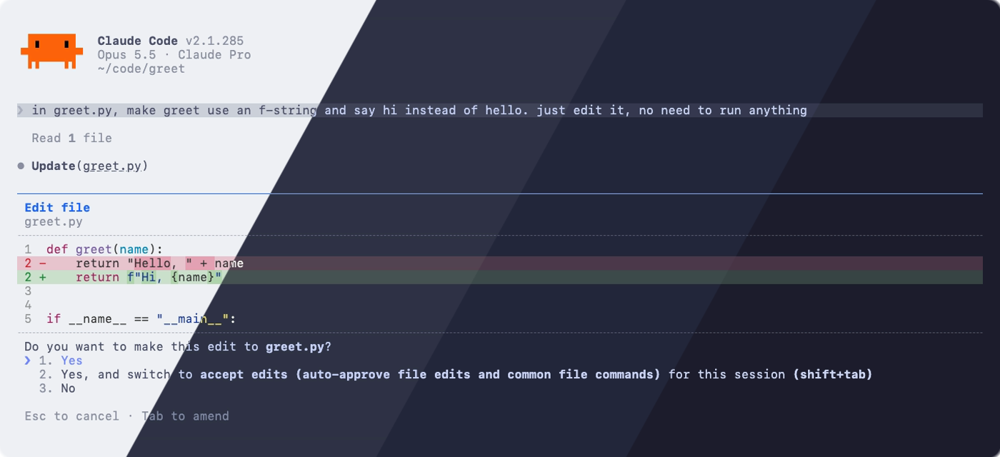
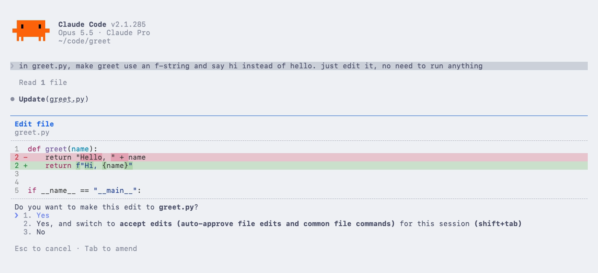
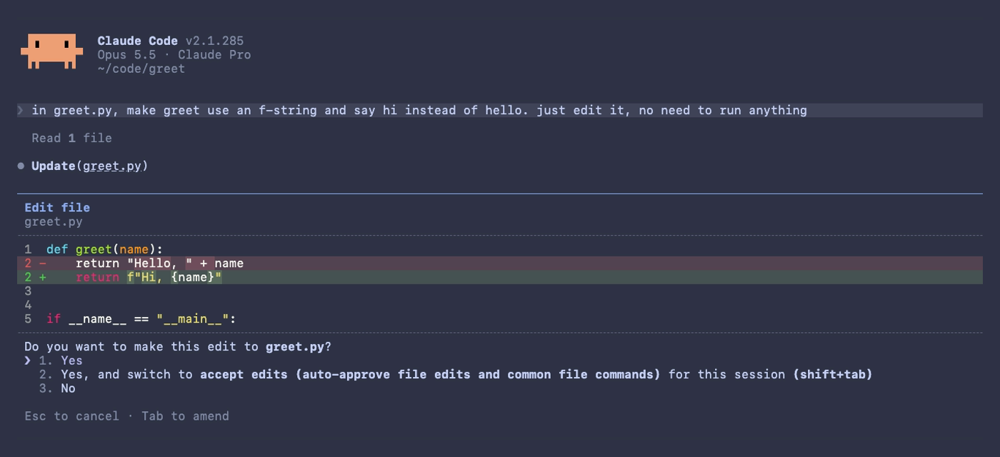
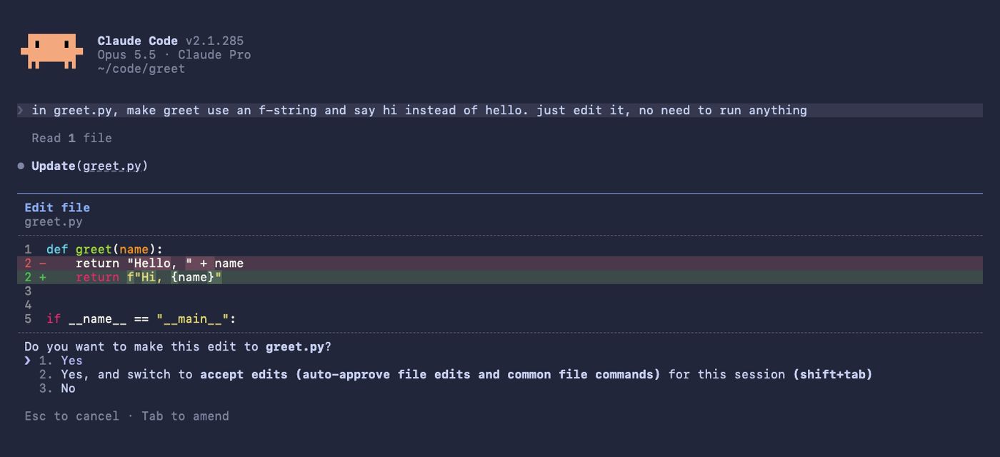
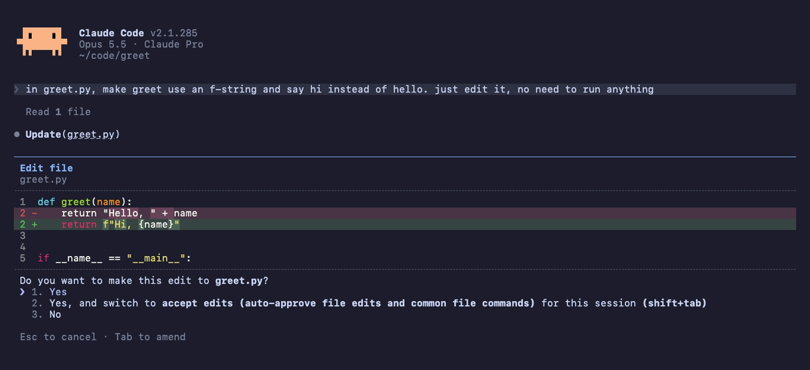

<h3 align="center">
	<br/>
	
	Catppuccin for <a href="https://code.claude.com">Claude Code</a>
	
</h3>

<p align="center">
	<a href="https://github.com/hlaclau/claude-code/stargazers"></a>
	<a href="https://github.com/hlaclau/claude-code/issues"></a>
	<a href="https://github.com/hlaclau/claude-code/contributors"></a>
</p>

<p align="center">
	
</p>

## Previews

<details>
<summary>🌻 Latte</summary>

</details>
<details>
<summary>🪴 Frappé</summary>

</details>
<details>
<summary>🌺 Macchiato</summary>

</details>
<details>
<summary>🌿 Mocha</summary>

</details>

## Usage

All four flavors ship as a Claude Code plugin that contains only theme files. It runs no code, has no hooks or MCP servers, and makes no network requests.

1. Add the marketplace and install the plugin:

   ```
   /plugin marketplace add hlaclau/claude-code
   /plugin install catppuccin@catppuccin
   ```

2. Run `/theme` and pick **Catppuccin Latte**, **Frappé**, **Macchiato** or **Mocha**.

Prefer not to use a plugin? Copy a flavor from [`themes/`](themes) into `~/.claude/themes/` and pick it in `/theme`.

## 🙋 FAQ

- Q: **_"Which colors map to which parts of the interface?"_**\
  A: Mauve is the main accent, overlay shades are used for borders and hints, surface shades for message backgrounds, and the diff backgrounds blend green and red into each flavor's base.

## 💝 Thanks to

- [hlaclau](https://github.com/hlaclau)

&nbsp;

<p align="center">
	
</p>

<p align="center">
	Copyright &copy; 2021-present <a href="https://github.com/catppuccin" target="_blank">Catppuccin Org</a>
</p>

<p align="center">
	<a href="https://github.com/catppuccin/catppuccin/blob/main/LICENSE"></a>
</p>
